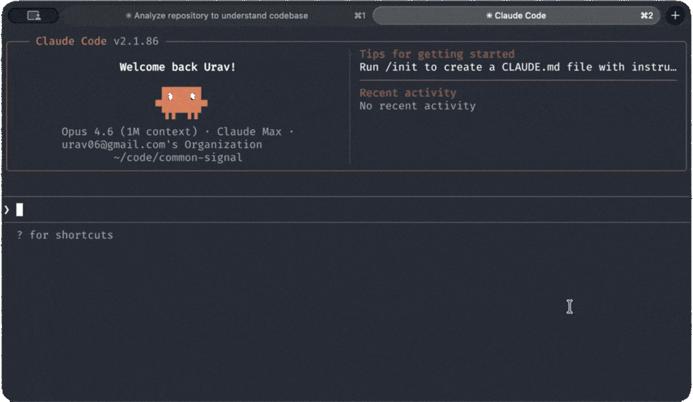

<div align="center">

# claudestrophobic

*Because `064ddd26-9a3f-...` is not a name.*


<br>



</div>

---

A [Claude Code](https://claude.ai/code) plugin that maps your conversations to human-readable names and lets you manage them without leaving the chat. Unlike MCP tools, this sits completely outside your context window.

## Install

```
/plugin marketplace add urav/claudestrophobic
/plugin install claudestrophobic
```

## Usage

```
/sessions                              # list all sessions
/sessions delete fix auth middleware   # trash by name (fuzzy match)
/sessions delete 064ddd26             # trash by partial UUID
/sessions prune --older 2w            # trash sessions older than 2 weeks
/sessions browse                      # open project's .claude directory
```

## Why

On claude.ai, your conversations live in a sidebar. Named, browsable, deletable. In Claude Code, they become invisible UUID files under `~/.claude/projects/`. This brings that visibility back.

## How it works

A Python script reads `~/.claude/history.jsonl` and maps each session to its `/rename` title or first message. Claude receives the table and handles matching, deletion (to system Trash, not `rm`), and interaction.

Only loads into context when you invoke `/sessions`. Zero overhead otherwise.
